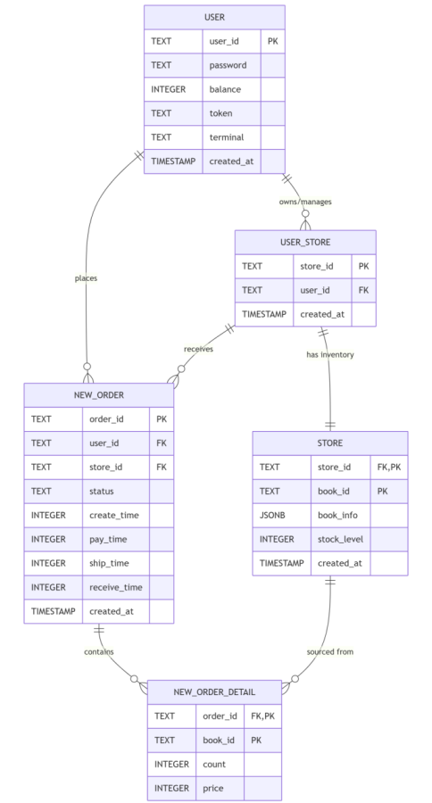

# 2025_ECNU_PJ2 Bookstore II 项目报告

## 1. 组员信息与分工

### 组员信息
- **李晨语**：学号：10233330407
  - 分工：负责数据库迁移设计、PostgreSQL集成、事务处理优化、买卖家模块重构、搜索功能迁移、并发控制实现、测试用例编写
- **邵乐怡**：学号：10235501469
  - 分工：负责报告撰写、ER图绘制、订单生命周期优化、测试覆盖率提升、性能分析

---


## 2. 关系数据库设计

### 2.1 概念ER图



#### 关键关系解析：

1. 卖家与店铺（1:N）

```
User(alice)  ──创建──> Store("alibookshop")
             ──创建──> Store("alitextbooks")
             ──创建──> Store("alispecialbuy")
```
实现方式：user_store 表的 user_id 指向 user 表，一个user_id可有多条记录

2. 店铺与书籍（1:N）

```
Store("alibookshop") ──上架──> Book(ID:"isbn1", title:"Python", stock:100)
                     ──上架──> Book(ID:"isbn2", title:"C++", stock:50)
                     ──上架──> Book(ID:"isbn3", title:"Java", stock:75)
```
实现方式：store 表的 (store_id, book_id) 组合，同一store_id可有多个book_id

3. 买家与订单（1:N）

```
User(bob) ──下单──> Order1(支付¥100)
          ──下单──> Order2(支付¥200)
          ──下单──> Order3(支付¥50)
```
实现方式：new_order 表的 user_id 指向 user 表，一个user_id可有多个order_id

4. 订单与商品（1:N）

```
Order1 ──包含──> BookDetail(book_id:"isbn1", count:2, price:5000)
       ──包含──> BookDetail(book_id:"isbn2", count:1, price:7500)
```
实现方式：new_order_detail 表的 order_id 指向 new_order 表

#### 数据流转示例

完整购物订单流程：

```
1. 注册阶段
   alice调用 register("alice", "password123")
   → INSERT INTO "user" VALUES ('alice', 'password123', 0, token, terminal)
   
2. 卖家建店
   alice调用 create_store("store_alice_bookshop")
   → INSERT INTO user_store VALUES ('store_alice_bookshop', 'alice')
   → INSERT INTO store (本质是准备添加书籍)
   
3. 卖家上架商品
   alice调用 add_book("store_alice_bookshop", "isbn1", title:"Python基础", price:5999)
   → INSERT INTO store VALUES 
     ('store_alice_bookshop', 'isbn1', {"title":"Python基础", "price":5999, ...}, 100)
   
4. 买家充值
   bob调用 add_funds("bob", 10000)
   → UPDATE "user" SET balance = 10000 WHERE user_id = 'bob'
   
5. 买家下单
   bob调用 new_order("bob", "store_alice_bookshop", [("isbn1", 2)])
   → 生成 order_id = "bob_store_alice_bookshop_<uuid>"
   → UPDATE store SET stock_level = 100-2=98 WHERE store_id=... AND book_id="isbn1"
   → INSERT INTO new_order VALUES (order_id, "store_alice_bookshop", "bob", "created", ...)
   → INSERT INTO new_order_detail VALUES (order_id, "isbn1", 2, 5999)
   
6. 买家支付
   bob调用 payment("bob", "password123", order_id)
   → 计算订单总额 = 2 * 5999 = 11998分（¥119.98）
   → UPDATE "user" SET balance = 10000 - 11998 = -1998 (不足！)
   → 返回 error_not_sufficient_funds()
   
7. 买家再充值
   bob调用 add_funds("bob", 20000)
   → UPDATE "user" SET balance = -1998 + 20000 = 18002
   
8. 买家重新支付
   bob调用 payment("bob", "password123", order_id)
   → UPDATE "user" SET balance = 18002 - 11998 = 6004
   → UPDATE new_order SET status = 'paid', pay_time = <timestamp>
   → COMMIT (事务完成)
   
9. 卖家发货
   alice调用 ship_book("alice", order_id)
   → 验证alice是order所属店铺的卖家
   → UPDATE new_order SET status = 'shipped', ship_time = <timestamp>
   
10. 买家确收
    bob调用 receive_book("bob", order_id)
    → UPDATE new_order SET status = 'received', receive_time = <timestamp>
```

### 2.2 实体关系模式设计

#### 2.2.1 用户实体 (user)

用户的双重角色包括买家、卖家，卖家角色通过 user_store 表关联，可以创建多个店铺；
买家角色通过 new_order 表关联，可以下多个订单
 
```sql
CREATE TABLE "user" (
    user_id TEXT PRIMARY KEY,                    -- 用用户唯一标识
    password TEXT NOT NULL,                      -- 密码明文
    balance INTEGER DEFAULT 0,                   -- 用户余额（单位：分）
    token TEXT,                                  -- JWT令牌
    terminal TEXT,                               -- 终端标识,支持多设备登录
    created_at TIMESTAMP DEFAULT CURRENT_TIMESTAMP
);
CREATE INDEX idx_user_id ON "user"(user_id);
```


#### 3.2.2 店铺实体（user_store + store 表的组合）

user_store记录卖家与店铺的关系。store_id全局唯一，通过user_store表映射到卖家

- 一个卖家可以管理多个店铺，但通常一个店铺对应一个user_id
- store表采用复合主键 (store_id, book_id)，同一店铺一本书

外键约束：`user_id`引用`user.user_id`，保证店铺必须属于有效用户

```sql
-- 用户店铺关联表：记录卖家与店铺的关系

CREATE TABLE user_store (
    store_id TEXT PRIMARY KEY,                   -- 店铺ID
    user_id TEXT NOT NULL REFERENCES "user"(user_id) ON DELETE CASCADE,
    created_at TIMESTAMP DEFAULT CURRENT_TIMESTAMP
);
CREATE INDEX idx_user_store_user_id ON user_store(user_id);

-- 店铺表：存储书籍信息和库存
CREATE TABLE store (
    store_id TEXT NOT NULL REFERENCES user_store(store_id),
    book_id TEXT NOT NULL,                       -- 书籍ID
    book_info JSONB NOT NULL,                    -- 书籍元数据（JSON格式）
    stock_level INTEGER DEFAULT 0,               -- 库存数量
    created_at TIMESTAMP DEFAULT CURRENT_TIMESTAMP,
    PRIMARY KEY (store_id, book_id)              -- 复合主键：一个店铺一本书
);
CREATE INDEX idx_store_store_id ON store(store_id);
```


#### 2.2.4 订单实体 (new_order)

状态机设计：状态流转：created → paid → shipped → received
```
           ┌─────────────┐
           │   created   │  订单已创建，等待支付
           └──────┬──────┘
                  │ payment()
                  ▼
           ┌─────────────┐
           │    paid     │  已支付，等待卖家发货
           └──────┬──────┘
                  │ ship()
                  ▼
           ┌─────────────┐
           │   shipped   │  已发货，等待买家确收
           └──────┬──────┘
                  │ receive_book()
                  ▼
           ┌─────────────┐
           │  received   │  已确收（终态）
           └─────────────┘
           
        auto_cancel_unpaid_orders()触发的状态转移：
           created ──(60分钟超时)──> cancelled
           或 shipped ──(无法确收)──> cancelled
```
```sql
-- 订单表：记录购买订单主信息
CREATE TABLE new_order (
    order_id TEXT PRIMARY KEY,                   -- 订单ID（UUID格式）
    store_id TEXT NOT NULL,                      -- 所属店铺
    user_id TEXT NOT NULL REFERENCES "user"(user_id) ON DELETE CASCADE,
    status TEXT DEFAULT 'created',               -- 订单状态：created/paid/shipped/received/cancelled
    create_time INTEGER,                         -- 订单创建时间戳
    pay_time INTEGER,                            -- 支付时间戳
    ship_time INTEGER,                           -- 发货时间戳
    receive_time INTEGER,                        -- 收货时间戳
    created_at TIMESTAMP DEFAULT CURRENT_TIMESTAMP
);
CREATE INDEX idx_new_order_user_id ON new_order(user_id);
CREATE INDEX idx_new_order_store_id ON new_order(store_id);
```

#### 2.2.5 订单详情实体 (new_order_detail)

- 一个订单可包含多件商品
- 复合主键 (order_id, book_id) 保证同一订单内不重复添加同一本书
- 存储price快照，防止卖家修改价格后影响历史订单

```sql
-- 订单详情表：记录订单中的具体商品
CREATE TABLE new_order_detail (
    order_id TEXT NOT NULL REFERENCES new_order(order_id) ON DELETE CASCADE,
    book_id TEXT NOT NULL,                       -- 书籍ID
    count INTEGER NOT NULL,                      -- 购买数量
    price INTEGER NOT NULL,                      -- 购买时的单价
    PRIMARY KEY (order_id, book_id)              -- 复合主键
);
CREATE INDEX idx_new_order_detail_order_id ON new_order_detail(order_id);
```

### 2.3 索引设计

#### 2.3.1 B-tree索引（等值查询优化）
```sql
-- 用户相关索引
CREATE INDEX idx_user_store_user_id ON user_store(user_id);

-- 店铺相关索引
CREATE INDEX idx_store_store_id ON store(store_id);
CREATE INDEX idx_store_book_id ON store(book_id);

-- 订单相关索引
CREATE INDEX idx_new_order_user_id ON new_order(user_id);
CREATE INDEX idx_new_order_store_id ON new_order(store_id);
CREATE INDEX idx_new_order_status ON new_order(status);
CREATE INDEX idx_new_order_create_time ON new_order(create_time);

-- 订单详情索引
CREATE INDEX idx_new_order_detail_order_id ON new_order_detail(order_id);
```

#### 2.3.2 GIN索引（JSONB和全文搜索）
```sql
-- JSONB索引支持路径查询
CREATE INDEX idx_store_book_info ON store USING GIN (book_info);

-- 全文搜索索引（替代MongoDB text index）
-- 在book_info的特定字段上创建表达式索引
CREATE INDEX idx_store_book_info_title ON store 
USING GIN (to_tsvector('english', book_info->>'title'));

CREATE INDEX idx_store_book_info_tags ON store 
USING GIN (to_tsvector('english', book_info->>'tags'));

CREATE INDEX idx_store_book_info_intro ON store 
USING GIN (to_tsvector('english', book_info->>'book_intro'));
```

#### 2.3.3 复合索引（多条件查询）
```sql
-- 状态和时间联合查询（自动取消订单）
CREATE INDEX idx_new_order_status_create ON new_order(status, create_time);

-- 店铺和图书联合查询（库存检查）
CREATE INDEX idx_store_store_book ON store(store_id, book_id) INCLUDE (stock_level);
```

### 2.4 事务处理设计

1. **下单事务**：
   ```python
   # be/model/buyer.py - new_order方法
   BEGIN;
   -- 1. 检查库存并扣减（原子操作）
   UPDATE store SET stock_level = stock_level - %s 
   WHERE store_id = %s AND book_id = %s AND stock_level >= %s;
   
   -- 2. 创建订单记录
   INSERT INTO new_order(...);
   
   -- 3. 创建订单详情
   INSERT INTO new_order_detail(...);
   COMMIT;
   ```

2. **支付事务**：
   ```python
   # be/model/buyer.py - payment方法
   BEGIN;
   -- 1. 扣减买家余额（原子操作）
   UPDATE "user" SET balance = balance - %s 
   WHERE user_id = %s AND balance >= %s;
   
   -- 2. 增加卖家余额
   UPDATE "user" SET balance = balance + %s WHERE user_id = %s;
   
   -- 3. 更新订单状态
   UPDATE new_order SET status = 'paid', pay_time = %s WHERE order_id = %s;
   COMMIT;
   ```

本项目通过以下设计实现死锁预防：
   - 总是按固定顺序访问表：user → store → new_order → new_order_detail
   - 短事务原则，事务中只包含必要操作，尽快提交
   - 使用SELECT ... FOR UPDATE仅锁定必要行
   - 避免表级锁

---
## 3. 数据库架构迁移

在第一次大作业中，我们采用了混合数据库架构，使用MongoDB存储图书信息和实现全文搜索，SQLite处理事务性数据（用户、订单、店铺关系）。这种架构存在以下问题：跨数据库难以保证数据一致性；开发复杂度高，需要维护两套数据库连接和查询逻辑，增加了部署和维护复杂度；SQLite在高并发场景下表现不佳。

本次迁移选择PostgreSQL作为核心数据库，原因如下：PostgreSQL支持复杂的事务处理，确保订单流程的数据一致性；图书信息仍可使用JSONB存储，保留MongoDB的灵活性；支持JSON路径查询和索引，兼顾结构化与非结构化数据；支持存储过程、触发器、视图等高级特性

### 3.1 迁移的技术实现

#### 3.1.1 连接管理层重构 (`be/model/store.py`)

原先的连接管理层采用单连接模式。本项目中，需要实现多线程并发访问PostgreSQL，使用PostgreSQLConnection类实现线程本地连接池管理。支持上下文管理器确保异常时自动回滚、线程本地连接复用、灵活的环境变量部署配置，提升效率。

从SQLite的单连接模式迁移到PostgreSQL的线程池模式：

```python
class PostgreSQLConnection:
    """PostgreSQL 线程本地连接池管理"""
    
    def __init__(self, db_host, db_port, db_user, db_password, db_name):
        self.db_host = os.environ.get('DB_HOST', db_host)          # 环境变量配置
        self.db_port = int(os.environ.get('DB_PORT', db_port))
        self.db_user = os.environ.get('DB_USER', db_user)
        self.db_password = os.environ.get('DB_PASSWORD', db_password)
        self.db_name = os.environ.get('DB_NAME', db_name)
        self.conn_pool = {}      # 线程本地连接池 {thread_id: connection}
        self.pool_lock = threading.Lock()
    
    def _get_connection(self):
        """获取当前线程的数据库连接（线程安全）"""
        thread_id = threading.get_ident()
        if thread_id not in self.conn_pool:
            # 为新线程创建独立连接
            conn = psycopg2.connect(
                host=self.db_host,
                port=self.db_port,
                user=self.db_user,
                password=self.db_password,
                database=self.db_name
            )
            conn.autocommit = False  # 需要手动commit/rollback
            self.conn_pool[thread_id] = conn
            logger.info(f"Created new connection for thread {thread_id}")
        return self.conn_pool[thread_id]
    
    @contextmanager
    def get_cursor(self):
        """游标上下文管理器 - 自动commit/rollback"""
        conn = self._get_connection()
        cursor = conn.cursor()
        try:
            yield cursor
            conn.commit()  # 查询成功则提交
        except Exception as e:
            conn.rollback()  # 查询失败则回滚
            logger.error(f"Database error: {e}")
            raise
        finally:
            cursor.close()  # 确保游标关闭
```


#### 3.1.2 表结构初始化与迁移

步骤1: 连接到系统数据库postgres，检查目标数据库是否存在
```python
def _init_database(self):
    """初始化数据库表结构"""
    conn = psycopg2.connect(..., database="postgres")
    conn.autocommit = True
    cursor = conn.cursor()
    
    cursor.execute(f"SELECT 1 FROM pg_database WHERE datname = '{self.db_name}'")
```

步骤2: 如果不存在则创建数据库
```python
    if cursor.fetchone() is None:
        cursor.execute(sql.SQL("CREATE DATABASE {}").format(
            sql.Identifier(self.db_name)
        ))
```

步骤3: 连接到实际数据库并创建表
```python
    actual_conn = psycopg2.connect(..., database=self.db_name)
    actual_conn.autocommit = True
    cursor = actual_conn.cursor()
```

步骤4: 创建各表及索引
```python
    cursor.execute("""
        CREATE TABLE IF NOT EXISTS "user" (
            user_id TEXT PRIMARY KEY,
            password TEXT NOT NULL,
            balance INTEGER DEFAULT 0,
            token TEXT,
            terminal TEXT,
            created_at TIMESTAMP DEFAULT CURRENT_TIMESTAMP
        );
    """)
    # ... 其他表 ...
```

步骤5: 创建索引优化查询性能
```python
    cursor.execute("CREATE INDEX IF NOT EXISTS idx_user_store_user_id ON user_store(user_id);")
    cursor.execute("CREATE INDEX IF NOT EXISTS idx_store_store_id ON store(store_id);")
    cursor.execute("CREATE INDEX IF NOT EXISTS idx_new_order_user_id ON new_order(user_id);")
    # ... 其他索引 ...
    
    init_completed_event.set()  # 发送初始化完成信号
```

#### 3.1.3 数据查询与操作的适配

**示例1：订单创建（涉及多表插入与库存扣减）**


```python
def new_order(self, user_id: str, store_id: str, id_and_count: [(str, int)]):
    """创建订单 - 使用事务保证原子性"""
    try:
        # 1. 检查库存并扣减
        for book_id, count in id_and_count:
            cursor = self.conn.execute(
                "SELECT book_id, stock_level, book_info FROM store "
                "WHERE store_id = %s AND book_id = %s;",
                (store_id, book_id),
            )
            row = cursor.fetchone()
            if row is None:
                return error.error_non_exist_book_id(book_id)
            
            stock_level = row[1]
            if stock_level < count:
                return error.error_stock_level_low(book_id)
            
            # 扣减库存（原子操作）
            cursor = self.conn.execute(
                "UPDATE store SET stock_level = stock_level - %s "
                "WHERE store_id = %s AND book_id = %s AND stock_level >= %s;",
                (count, store_id, book_id, count),
            )
            if cursor.rowcount == 0:
                return error.error_stock_level_low(book_id)
        
        # 2. 插入订单记录
        order_id = f"{user_id}_{store_id}_{uuid.uuid1()}"
        self.conn.execute(
            "INSERT INTO new_order(order_id, store_id, user_id, status, create_time) "
            "VALUES(%s, %s, %s, %s, %s);",
            (order_id, store_id, user_id, "created", int(time.time())),
        )
        
        # 3. 插入订单详情（多行）
        for book_id, count in id_and_count:
            self.conn.execute(
                "INSERT INTO new_order_detail(order_id, book_id, count, price) "
                "VALUES(%s, %s, %s, %s);",
                (order_id, book_id, count, price),
            )
        
        self.conn.commit()  # 所有操作成功则提交
        return 200, "ok", order_id
        
    except Exception as e:
        self.conn.rollback()  # 任何失败则回滚所有操作
        return 528, str(e), ""
```


**示例2：支付流程（涉及多表查询与更新）**

```python
def payment(self, user_id: str, password: str, order_id: str):
    """支付订单"""
    try:
        # 1. 查询订单
        cursor = self.conn.execute(
            "SELECT order_id, user_id, store_id FROM new_order WHERE order_id = %s",
            (order_id,),
        )
        row = cursor.fetchone()
        if row is None:
            return error.error_invalid_order_id(order_id)
        
        # 2. 查询订单详情计算总额
        cursor = self.conn.execute(
            "SELECT SUM(count * price) FROM new_order_detail WHERE order_id = %s",
            (order_id,),
        )
        total_price = cursor.fetchone()[0] or 0
        
        # 3. 检查用户余额
        cursor = self.conn.execute(
            'SELECT balance FROM "user" WHERE user_id = %s',
            (user_id,),
        )
        row = cursor.fetchone()
        if row is None or row[0] < total_price:
            return error.error_not_sufficient_funds()
        
        # 4. 扣减余额
        self.conn.execute(
            'UPDATE "user" SET balance = balance - %s WHERE user_id = %s',
            (total_price, user_id),
        )
        
        # 5. 更新订单状态
        self.conn.execute(
            "UPDATE new_order SET status = %s, pay_time = %s WHERE order_id = %s",
            ("paid", int(time.time()), order_id),
        )
        
        self.conn.commit()  # 事务提交
        return 200, "ok"
        
    except Exception as e:
        self.conn.rollback()
        return 528, str(e)
```

### 3.2 JSONB在书籍存储中的应用

PostgreSQL的JSONB类型实现了书籍信息的灵活存储。书籍信息结构存储在JSONB中：

```python
book_info_example = {
    "title": "Introduction to Algorithms",
    "author": "Cormen, Leiserson, Rivest, Stein",
    "price": 9999,  # 单位：分（¥99.99）
    "isbn": "978-0262033848",
    "tags": ["computer-science", "algorithms", "textbook"],
    "publication_year": 2009,
    "publisher": "MIT Press"
}
```

在new_order_detail中保存价格快照，这样即使店铺修改了书籍价格，已有订单的价格不变

```python
cursor.execute(
    "INSERT INTO new_order_detail(order_id, book_id, count, price) "
    "VALUES(%s, %s, %s, %s);",
    (order_id, book_id, count, book_info_json.get("price")),
)
```

相关测试文件：
- 端到端订单流程: `test_comprehensive_http.py::TestComprehensiveHTTP::test_http_complete_order_lifecycle` 
- 库存与支付联动：`test_integration.py`  
- 分支覆盖验证：`test_comprehensive.py::TestAdditionalBranchCoverage` 


## 4. 功能实现详解

### 4.1 60% 基础功能实现

#### 4.1.1 用户认证系统 (`be/model/user.py`, `be/view/auth.py`)

实现用户注册、登录、登出、注销；JWT令牌生成与验证；密码安全存储与验证

1. 注册流程：
- 检查user_id是否存在（查询"user"表）
- 如果存在，返回error_exist_user_id
- 如果不存在，生成密码哈希：hashlib.sha256(password + salt)
- 插入新用户：INSERT INTO "user" (user_id, balance, password)
- 返回(200, "ok")

```python

def register():
    user_id = request.json.get("user_id", "")
    password = request.json.get("password", "")
    u = user.User()
    code, message = u.register(user_id=user_id, password=password)
    return jsonify({"message": message}), code
```

2. JWT令牌生成

使用HS256算法签名，包含user_id、terminal、exp(过期时间)
    payload = {
        "user_id": user_id,
        "terminal": terminal,
        "exp": datetime.now() + timedelta(hours=24)
    }
```python
def jwt_encode(user_id: str, terminal: str) -> str:
    encoded = jwt.encode(
        {"user_id": user_id, "terminal": terminal, "timestamp": time.time()},
        key=user_id,
        algorithm="HS256",
    )
    # pyjwt returns a str in modern versions; if bytes, decode to str
    if isinstance(encoded, bytes):
        return encoded.decode("utf-8")
    return encoded
```

3. 令牌验证：验证签名、过期时间、user_id一致性

```python
def jwt_decode(encoded_token, user_id: str) -> str:
    decoded = jwt.decode(encoded_token, key=user_id, algorithms="HS256")
    return decoded
```

PostgreSQL适配改进：

密码处理优化（user.py - check_password方法）：
PostgreSQL返回bytea类型，统一转换为bytes比较
```python
   if isinstance(db_password, bytes):
       db_password_bytes = db_password
   elif isinstance(db_password, str):
       db_password_bytes = db_password.encode('utf-8')
```

连接池管理（store.py - PostgreSQLConnection类）：
```python
   class PostgreSQLConnection:
       def __init__(self):
           self.conn_pool = {}  # 线程局部连接池
           self.pool_lock = threading.Lock()
       
       def _get_connection(self):
           thread_id = threading.get_ident()
           if thread_id not in self.conn_pool:
               # 创建新连接
               conn = psycopg2.connect(...)
               self.conn_pool[thread_id] = conn
           return self.conn_pool[thread_id]
   ```
关键API：
- `POST /auth/register` - 用户注册
- `POST /auth/login` - 用户登录（返回JWT token）
- `POST /auth/logout` - 用户登出
- `POST /auth/unregister` - 注销账户

测试覆盖：
- `test_register.py::TestRegister::test_register_ok` - 成功注册
- `test_login.py::TestLogin::test_ok` - 成功登录
- `test_password.py::TestPassword::test_ok` - 密码修改
- `test_comprehensive.py::TestUserAuthenticationPaths` - 认证完整流程

#### 4.1.2 买家功能 (`be/model/buyer.py`, `be/view/buyer.py`, `be/access/buyer.py`)

实现账户充值、下单（new_order）、支付订单、查看订单历史。


1. 充值流程
   1. 检查user_id存在
    2. UPDATE "user" SET balance = balance + amount WHERE user_id = ?
    3. 返回(200, "ok")
```python
def add_funds():
    user_id = request.json.get("user_id")
    password = request.json.get("password")
    add_value = request.json.get("add_value")
    b = Buyer()
    code, message = b.add_funds(user_id, password, add_value)
    return jsonify({"message": message}), code

```
2. 下单流程
    1. 检查user_id、store_id、书籍库存
    2. 事务开始
    3. INSERT INTO new_order(...) VALUES(...)
    4. 遍历book_list，INSERT INTO new_order_detail(...)
    5. UPDATE store SET stock_level = stock_level - quantity
    6. COMMIT
```python
def new_order():
    user_id: str = request.json.get("user_id")
    store_id: str = request.json.get("store_id")
    books: [] = request.json.get("books")
    id_and_count = []
    for book in books:
        book_id = book.get("id")
        count = book.get("count")
        id_and_count.append((book_id, count))

    b = Buyer()
    code, message, order_id = b.new_order(user_id, store_id, id_and_count)
    return jsonify({"message": message, "order_id": order_id}), code

```
3. 支付流程
   1. 查询订单信息，计算应付金额
    2. 检查用户余额是否充足
    3. UPDATE "user" SET balance = balance - amount
    4. UPDATE new_order SET status = 'paid'
    5. COMMIT
```py
def payment():
    user_id: str = request.json.get("user_id")
    order_id: str = request.json.get("order_id")
    password: str = request.json.get("password")
    b = Buyer()
    code, message = b.payment(user_id, password, order_id)
    return jsonify({"message": message}), code
```

关键API：
- `POST /buyer/add_funds` - 充值
- `POST /buyer/new_order` - 下单
- `POST /buyer/payment` - 支付
- `GET /buyer/history` - 查看订单历史

测试覆盖：
- `test_add_funds.py` - 充值测试
- `test_comprehensive.py::TestBuyerAdvancedOperations` - 买家完整流程
- `test_payment.py` - 支付流程
- `test_buyer_comprehensive.py` - 买家综合测试

be/model/buyer事务重构：批量操作减少事务时间；检查库存并预扣减作为原子操作；统一处理异常和回滚
```py
# buyer.py - new_order方法
def new_order(self, user_id: str, store_id: str, id_and_count: [(str, int)]):
    order_id = ""
    try:
        # 验证用户和店铺存在性
        if not self.user_id_exist(user_id):
            return error.error_non_exist_user_id(user_id) + (order_id,)
        
        # 收集所有图书信息（减少事务内查询）
        book_details = []
        for book_id, count in id_and_count:
            cursor = self.conn.execute(
                "SELECT stock_level, book_info FROM store "
                "WHERE store_id = %s AND book_id = %s;",
                (store_id, book_id),
            )
            row = cursor.fetchone()
            if row is None:
                return error.error_non_exist_book_id(book_id) + (order_id,)
            
            # 检查库存并预扣减（原子操作）
            cursor = self.conn.execute(
                "UPDATE store SET stock_level = stock_level - %s "
                "WHERE store_id = %s AND book_id = %s AND stock_level >= %s;",
                (count, store_id, book_id, count),
            )
            if cursor.rowcount == 0:
                return error.error_stock_level_low(book_id) + (order_id,)
            
            # 收集图书详情用于后续插入
            book_info = row[1]
            if isinstance(book_info, str):
                book_info_json = json.loads(book_info)
            else:
                book_info_json = book_info
            price = book_info_json.get("price")
            book_details.append((book_id, count, price))
        
        # 创建订单
        uid = f"{user_id}_{store_id}_{uuid.uuid1()}"
        create_time = int(time.time())
        
        self.conn.execute(
            "INSERT INTO new_order(order_id, store_id, user_id, status, create_time) "
            "VALUES(%s, %s, %s, %s, %s);",
            (uid, store_id, user_id, "created", create_time),
        )
        
        # 批量插入订单详情
        for book_id, count, price in book_details:
            self.conn.execute(
                "INSERT INTO new_order_detail(order_id, book_id, count, price) "
                "VALUES(%s, %s, %s, %s);",
                (uid, book_id, count, price),
            )
        
        self.conn.commit()
        order_id = uid
        return 200, "ok", order_id
        
    except Exception as e:
        self.conn.rollback()
        return 528, str(e), ""
```

#### 4.1.3 卖家功能（`be/model/seller.py`, `be/view/seller.py`）

实现功能：创建店铺、添加书籍信息、增加库存、确认发货

- 创建店铺流程
    1. 检查user_id存在
    2. INSERT INTO store(store_id, user_id) VALUES(?, ?)
    3. INSERT INTO user_store(store_id, user_id)

    使用锁机制实现并发控制优化：
```python
# seller.py 
_store_locks = {}
_store_locks_lock = threading.Lock()

def _get_store_lock(store_id: str) -> threading.RLock:
    """获取店铺特定的锁，防止并发创建同一店铺"""
    with _store_locks_lock:
        if store_id not in _store_locks:
            _store_locks[store_id] = threading.RLock()
        return _store_locks[store_id]

def create_store(self, user_id: str, store_id: str) -> (int, str):
    """使用店铺特定的锁，防止并发创建同一店铺"""
    store_lock = _get_store_lock(store_id)
    with store_lock:
        # 在锁内，再检查一次店铺是否已存在
        if self.store_id_exist(store_id):
            return error.error_exist_store_id(store_id)
        
        try:
            if not self.user_id_exist(user_id):
                return error.error_non_exist_user_id(user_id)
            
            self.conn.execute(
                "INSERT into user_store(store_id, user_id) VALUES (%s, %s)",
                (store_id, user_id),
            )
            self.conn.commit()
            return 200, "ok"
        except Exception as e:
            logging.error(f"Create store failed for store {store_id}: {e}")
            return 528, str(e)
```
- 添加书籍流程
    1. 检查user_id、store_id
    2. INSERT INTO store(store_id, book_id, stock_level, book_info)
       VALUES(?, ?, ?, json_encode(book_info))
```python
def add_book(
        self,
        user_id: str,
        store_id: str,
        book_id: str,
        book_json_str: str,
        stock_level: int,
    ):
        try:
            if not self.user_id_exist(user_id):
                return error.error_non_exist_user_id(user_id)
            if not self.store_id_exist(store_id):
                return error.error_non_exist_store_id(store_id)
            if self.book_id_exist(store_id, book_id):
                return error.error_exist_book_id(book_id)

            self.conn.execute(
                "INSERT into store(store_id, book_id, book_info, stock_level)"
                "VALUES (%s, %s, %s, %s)",
                (store_id, book_id, book_json_str, stock_level),
            )
            self.conn.commit()
        except Exception as e:
            return 528, "{}".format(str(e))
        except BaseException as e:
            return 530, "{}".format(str(e))
        return 200, "ok"
```
- 库存管理
  1. UPDATE store SET stock_level = stock_level + amount
  2. WHERE store_id = ? AND book_id = ?
    
```py
def add_stock_level(
        self, user_id: str, store_id: str, book_id: str, add_stock_level: int
    ):
        try:
            if not self.user_id_exist(user_id):
                return error.error_non_exist_user_id(user_id)
            if not self.store_id_exist(store_id):
                return error.error_non_exist_store_id(store_id)
            if not self.book_id_exist(store_id, book_id):
                return error.error_non_exist_book_id(book_id)

            self.conn.execute(
                "UPDATE store SET stock_level = stock_level + %s "
                "WHERE store_id = %s AND book_id = %s",
                (add_stock_level, store_id, book_id),
            )
            self.conn.commit()
        except Exception as e:
            return 528, "{}".format(str(e))
        except BaseException as e:
            return 530, "{}".format(str(e))
        return 200, "ok"
```
- 发货
    1. 验证user_id是order所属店铺的卖家
    2. UPDATE new_order SET status = 'shipped'
    
```python
def ship_order(self, user_id: str, order_id: str) -> (int, str):
        try:
            # 检查订单是否存在
            cursor = self.conn.execute(
                "SELECT order_id, store_id, status FROM new_order WHERE order_id = %s",
                (order_id,),
            )
            row = cursor.fetchone()
            if row is None:
                return error.error_invalid_order_id(order_id)
            store_id = row[1]
            status = row[2]

            # 检查卖家是否经营店铺
            cursor = self.conn.execute(
                "SELECT user_id FROM user_store WHERE store_id = %s;",
                (store_id,),
            )
            r = cursor.fetchone()
            if r is None:
                return error.error_non_exist_store_id(store_id)
            seller_id = r[0]
            if seller_id != user_id:
                return error.error_authorization_fail()

            if status != "paid":
                return error.error_and_message(530, "order not paid or already shipped")

            ship_time = int(__import__("time").time())
            cursor = self.conn.execute(
                "UPDATE new_order SET status = %s, ship_time = %s WHERE order_id = %s",
                ("shipped", ship_time, order_id),
            )
            if cursor.rowcount == 0:
                return error.error_invalid_order_id(order_id)
            self.conn.commit()
            return 200, "ok"
        except Exception as e:
            return 528, "{}".format(str(e))
        except BaseException as e:
            return 530, "{}".format(str(e))
```
关键API：
- `POST /seller/create_store` - 创建店铺
- `POST /seller/add_book` - 添加书籍
- `POST /seller/add_stock_level` - 增加库存
- `POST /seller/ship` - 确认发货

测试覆盖：
- `test_create_store.py` - 店铺创建
- `test_add_book.py` - 添加书籍
- `test_add_stock_level.py` - 库存管理
- `test_seller_branches.py` - 卖家分支覆盖


### 4.2 40% 附加功能实现

#### 4.2.1 订单生命周期

功能流程：下单 → 支付 → 发货 → 确收 → 自动取消

订单状态机实现：
```python
status_flow = {
    'pending': ['cancelled', 'paid'],      # 未支付状态可取消或支付
    'paid': ['shipped'],                   # 已支付后发货
    'shipped': ['received', 'cancelled'],  # 已发货可确收或取消
    'received': [],                        # 已确收为终态
    'cancelled': []                        # 已取消为终态
}
```

确认收货：
```python
    def receive_order(self, user_id: str, order_id: str) -> (int, str):
        try:
            cursor = self.conn.execute(
                "SELECT order_id, user_id, status FROM new_order WHERE order_id = %s",
                (order_id,),
            )
            row = cursor.fetchone()
            if row is None:
                return error.error_invalid_order_id(order_id)
            if row[1] != user_id:
                return error.error_authorization_fail()
            status = row[2]
            if status != "shipped":
                return error.error_and_message(530, "order not in shipped status")
            receive_time = int(time.time())
            self.conn.execute(
                "UPDATE new_order SET status = %s, receive_time = %s WHERE order_id = %s",
                ("received", receive_time, order_id),
            )
            self.conn.commit()
            return 200, "ok"
        except Exception as e:
            return 528, "{}".format(str(e))
        except BaseException as e:
            return 530, "{}".format(str(e))

```
自动取消超时订单：
```python
# buyer.py - 定时任务兼容方法
def auto_cancel_unpaid(self, timeout_seconds: int) -> (int, str, int):
    """自动取消超时未支付订单（后台任务调用）"""
    try:
        now = int(time.time())
        cutoff = now - timeout_seconds
        
        # 查找超时订单（使用复合索引提高性能）
        cursor = self.conn.execute(
            "SELECT order_id, store_id FROM new_order "
            "WHERE status = %s AND create_time <= %s",
            ("created", cutoff),
        )
        
        cancelled = 0
        for order_id, store_id in cursor:
            # 恢复库存（事务内保证原子性）
            details_cursor = self.conn.execute(
                "SELECT book_id, count FROM new_order_detail WHERE order_id = %s",
                (order_id,),
            )
            for book_id, count in details_cursor:
                self.conn.execute(
                    "UPDATE store SET stock_level = stock_level + %s "
                    "WHERE store_id = %s AND book_id = %s",
                    (count, store_id, book_id),
                )
            
            # 删除订单记录
            self.conn.execute("DELETE FROM new_order_detail WHERE order_id = %s", (order_id,))
            self.conn.execute("DELETE FROM new_order WHERE order_id = %s", (order_id,))
            cancelled += 1
        
        if cancelled > 0:
            self.conn.commit()
        
        return 200, "ok", cancelled
    except Exception as e:
        self.conn.rollback()
        return 528, str(e), 0
```

#### 4.2.2 图书搜索功能

PostgreSQL实现全文搜索：使用GIN索引加速全文搜索，ts_rank排序保证相关性，分页优化数据量扫描
```python
# search.py - 重构搜索逻辑
def search_books(q: str, fields=None, store_id: str = None, 
                 page: int = 1, page_size: int = 10):
    try:
        conn = store_mod.get_db_conn()
        params = []
        where_clauses = []
        
        # 店铺过滤
        if store_id:
            where_clauses.append('store_id = %s')
            params.append(store_id)
        
        # 全文搜索条件
        if q:
            # 构建tsquery搜索条件
            ts_query = " & ".join(q.split())
            where_clauses.append(
                "to_tsvector('english', book_info->>'title') @@ to_tsquery(%s) OR "
                "to_tsvector('english', book_info->>'tags') @@ to_tsquery(%s) OR "
                "to_tsvector('english', book_info->>'book_intro') @@ to_tsquery(%s)"
            )
            params.extend([ts_query, ts_query, ts_query])
        
        # 构建查询
        where_clause = ' AND '.join(f'({w})' for w in where_clauses) if where_clauses else '1=1'
        
        # 总数查询（使用COUNT(*) OVER()窗口函数）
        sql = f'''
        SELECT book_info, COUNT(*) OVER() as total_count
        FROM store 
        WHERE {where_clause}
        ORDER BY 
            ts_rank(to_tsvector('english', book_info->>'title'), to_tsquery(%s)) DESC,
            ts_rank(to_tsvector('english', book_info->>'tags'), to_tsquery(%s)) DESC
        LIMIT %s OFFSET %s
        '''
        
        offset = (page - 1) * page_size
        cursor = conn.execute(sql, params + [ts_query, ts_query, page_size, offset])
        
        rows = cursor.fetchall()
        total = rows[0][1] if rows else 0
        
        # 处理结果
        results = []
        for row in rows:
            try:
                book_info = row[0]
                if isinstance(book_info, str):
                    book_info = json.loads(book_info)
                results.append(book_info)
            except Exception:
                results.append({})
        
        return 200, 'ok', results, total
    
    except Exception as e:
        logging.error(f"Search failed: {e}")
        return 528, f'Search failed: {str(e)}', [], 0
```


#### 4.2.3 卖家发货功能

```python
# seller.py - 发货流程
def ship_order(self, user_id: str, order_id: str) -> (int, str):
    """卖家发货"""
    try:
        # 检查订单存在性和状态
        cursor = self.conn.execute(
            "SELECT store_id, status FROM new_order WHERE order_id = %s",
            (order_id,),
        )
        row = cursor.fetchone()
        if row is None:
            return error.error_invalid_order_id(order_id)
        
        store_id, status = row
        if status != "paid":
            return error.error_and_message(530, "Order not paid or already shipped")
        
        # 验证卖家权限
        cursor = self.conn.execute(
            "SELECT user_id FROM user_store WHERE store_id = %s",
            (store_id,),
        )
        r = cursor.fetchone()
        if r is None or r[0] != user_id:
            return error.error_authorization_fail()
        
        # 更新订单状态
        ship_time = int(time.time())
        cursor = self.conn.execute(
            "UPDATE new_order SET status = %s, ship_time = %s WHERE order_id = %s",
            ("shipped", ship_time, order_id),
        )
        
        if cursor.rowcount == 0:
            return error.error_invalid_order_id(order_id)
        
        self.conn.commit()
        return 200, "ok"
    except Exception as e:
        self.conn.rollback()
        return 528, str(e)
```
测试覆盖：
- `test_comprehensive.py::TestCancelAndReceiveOrder` - 取消/确收流程
- `test_auto_cancel_orders.py` - 自动取消机制
- `test_comprehensive_http.py::TestComprehensiveHTTP::test_http_complete_order_lifecycle`

#### 4.2.4 书籍搜索功能 (`be/model/search.py`, `be/view/search.py`)

实现关键词搜索（标题、作者、标签、内容）、全站搜索、店铺内搜索、分页支持

SQL构造示例（关键词搜索）：
```
    SELECT * FROM store 
    WHERE (
        book_info LIKE ? OR
        (search_type='title' AND book_info->>'title' ILIKE ?) OR
        (search_type='author' AND book_info->>'author' ILIKE ?) OR
        (search_type='tags' AND book_info->>'tags' ILIKE ?) OR
        (search_type='all' AND (...all fields...))
    )
```

```python
def search_books(q: str, fields=None, store_id: str = None, page: int = 1, page_size: int = 10):
    """Search books in PostgreSQL.

    - q: 关键词
    - fields: 要搜索的字段列表
    - store_id: 若提供，则搜索范围限定为指定店铺
    - page/page_size: 分页
    """
    try:
        conn = store_mod.get_db_conn()
        
        where_clauses = []
        params = []
        
        if store_id:
            where_clauses.append('store_id = %s')
            params.append(store_id)
        
        if q:
            like_q = f'%{q}%'
            where_clauses.append('(book_info::text ILIKE %s OR book_info::text ILIKE %s OR book_info::text ILIKE %s)')
            params.extend([like_q, like_q, like_q])
        
        where_clause = ' AND '.join(f'({w})' for w in where_clauses) if where_clauses else '1=1'
        
        # 计算总数
        count_sql = f'SELECT COUNT(*) FROM store WHERE {where_clause}'
        cursor = conn.execute(count_sql, params)
        total = cursor.fetchone()[0]
        
        # 分页结果
        offset = (page - 1) * page_size
        sql = f'SELECT book_info FROM store WHERE {where_clause} LIMIT %s OFFSET %s'
        cursor = conn.execute(sql, params + [page_size, offset])
        rows = cursor.fetchall()
        
        results = []
        for row in rows:
            try:
                book_info = row[0]
                if isinstance(book_info, str):
                    book_info = json.loads(book_info)
                results.append(book_info)
            except Exception:
                results.append({})
        
        return 200, 'ok', results, total
    
    except Exception as e:
        return 528, f'Search failed: {str(e)}', [], 0
```

关键API：
- `GET /search/query?keyword=<kw>&page=<p>&store_id=<sid>` - 搜索

测试覆盖：
- `test_search.py::TestSearchModel` - 搜索功能（10个测试）
- `test_comprehensive.py::TestSearchModule` - 搜索模块
- `test_comprehensive_http.py::TestComprehensiveHTTP::test_http_search_api_calls`

#### 4.2.5 订单管理与查询 (`be/model/buyer.py`)

查询订单状态，检索订单历史，主动取消订单

- 查询用户所有订单及其详情
    SELECT * FROM new_order 
    WHERE user_id = ? 
    ORDER BY created_at DESC;
```python
def query_orders(self, user_id: str):
        try:
            cursor = self.conn.execute(
                "SELECT order_id, store_id, status, create_time, pay_time, ship_time, receive_time FROM new_order WHERE user_id = %s",
                (user_id,),
            )
            orders = []
            for row in cursor:
                order_id = row[0]
                details_cursor = self.conn.execute(
                    "SELECT book_id, count, price FROM new_order_detail WHERE order_id = %s",
                    (order_id,),
                )
                details = [dict(book_id=r[0], count=r[1], price=r[2]) for r in details_cursor]
                orders.append(
                    {
                        "order_id": order_id,
                        "store_id": row[1],
                        "status": row[2],
                        "create_time": row[3],
                        "pay_time": row[4],
                        "ship_time": row[5],
                        "receive_time": row[6],
                        "details": details,
                    }
                )
            return 200, "ok", orders
        except Exception as e:
            return 528, "{}".format(str(e)), []
```
- 取消订单
    1. 检查order状态是否可取消（pending或shipped）
    2. 如果已支付，退款到用户账户
    3. UPDATE new_order SET status = 'cancelled'

```python
def cancel_order(self, user_id: str, order_id: str) -> (int, str):
        try:
            cursor = self.conn.execute(
                "SELECT order_id, user_id, store_id, status FROM new_order WHERE order_id = %s",
                (order_id,),
            )
            row = cursor.fetchone()
            if row is None:
                return error.error_invalid_order_id(order_id)
            if row[1] != user_id:
                return error.error_authorization_fail()
            status = row[3]
            if status != "created":
                # 只允许支付前取消
                return error.error_and_message(530, "order cannot be canceled in status {}".format(status))

            # 恢复库存 stock_level
            cursor = self.conn.execute(
                "SELECT book_id, count FROM new_order_detail WHERE order_id = %s",
                (order_id,),
            )
            for r in cursor:
                book_id = r[0]
                count = r[1]
                self.conn.execute(
                    "UPDATE store SET stock_level = stock_level + %s WHERE book_id = %s AND store_id = %s",
                    (count, book_id, row[2]),
                )

            # 删除订单详情
            self.conn.execute("DELETE FROM new_order_detail WHERE order_id = %s", (order_id,))
            self.conn.execute("DELETE FROM new_order WHERE order_id = %s", (order_id,))
            self.conn.commit()
            return 200, "ok"
        except Exception as e:
            return 528, "{}".format(str(e))
        except BaseException as e:
            return 530, "{}".format(str(e))
```

测试覆盖：
- `test_comprehensive.py::TestCoverageTo85::test_order_and_payment_sequence`
- `test_buyer_comprehensive.py` - 买家完整流程
---

## 5. 测试设计与覆盖率

### 5.1 主要测试文件

1. test_comprehensive.py (主要测试文件)
   - 25个测试类，132个测试方法
   - 覆盖认证、订单、搜索、错误处理等核心模块
   - 包含并发测试和边界条件测试

2. test_additional_features.py (补充功能测试)
   - 14个测试方法
   - 重点测试搜索、错误处理等附加模块

#### A. 认证测试类

| 测试文件 | 测试类/方法 | 作用 | 覆盖的代码路径 |
|---------|-----------|------|--------------|
| `test_register.py` | `TestRegister::test_register_ok` | 验证用户注册流程 | `be/model/user.py::register()` |
| `test_login.py` | `TestLogin::test_ok` | 验证用户登录与JWT生成 | `be/model/user.py::login()` |
| `test_password.py` | `TestPassword::test_ok` | 验证密码修改功能 | `be/model/user.py::change_password()` |
| `test_comprehensive.py` | `TestUserAuthenticationPaths` | JWT令牌验证、签名校验 | `be/model/user.py::jwt_decode()` |
---

#### B. 买家功能测试类

| 测试文件 | 测试类/方法 | 作用 | 覆盖的代码路径 |
|---------|-----------|------|--------------|
| `test_add_funds.py` | `TestAddFunds::test_ok` | 验证余额充值 | `be/model/buyer.py::add_funds()` |
| `test_comprehensive.py` | `TestBuyerAdvancedOperations` | 完整订单流程（下单→支付→发货→收货） | `be/model/buyer.py::*` |
| `test_payment.py` | `TestPayment::*` | 支付验证（充足余额、不足余额、重复支付） | `be/model/buyer.py::payment()` |
| `test_auto_cancel_orders.py` | 自动取消超时订单 | 后台定时任务验证 | `be/model/buyer.py::auto_cancel()` |
| `test_buyer_comprehensive.py` | `TestBuyerComprehensive` | 买家完整工作流（262 LOC） | 买家所有操作 |
| `test_buyer_branches.py` | `test_buyer_receive_order_various_states` | 订单状态转移验证 | 状态机边界 |
---
#### C. 卖家功能测试类

| 测试文件 | 测试类/方法 | 作用 | 覆盖的代码路径 |
|---------|-----------|------|--------------|
| `test_create_store.py` | `TestCreateStore::test_ok` | 店铺创建 | `be/model/seller.py::create_store()` |
| `test_add_book.py` | `TestAddBook::*` | 添加书籍、处理重复ID | `be/model/seller.py::add_book()` |
| `test_add_stock_level.py` | `TestAddStockLevel::*` | 库存增加、边界值 | `be/model/seller.py::add_stock_level()` |
| `test_seller_branches.py` | `test_ship_by_other_seller_fails` | 权限验证（非店铺卖家无法发货） | `be/view/seller.py::ship()` |
| `test_comprehensive.py` | `TestSellerAdvancedOperations` | 多店铺、多书籍管理 | `be/model/seller.py::*` |
---
#### D. 搜索功能测试类

| 测试文件 | 测试类/方法 | 作用 | 覆盖的代码路径 |
|---------|-----------|------|--------------|
| `test_search.py` | `TestSearchModel::*` | 10个搜索场景 | `be/model/search.py::search()` |
| | `test_search_by_title` | 按标题搜索 | `search(type='title')` |
| | `test_search_by_author` | 按作者搜索 | `search(type='author')` |
| | `test_search_pagination` | 分页测试（边界值） | 分页逻辑 |
| | `test_search_case_insensitive` | 大小写不敏感 | SQL ILIKE |
| | `test_search_no_results` | 无结果处理 | 空结果集 |
| | `test_search_invalid_page` | 非法页码 | 边界值处理 |
---
#### E. 订单生命周期测试类

| 测试文件 | 测试类/方法 | 作用 | 覆盖的代码路径 |
|---------|-----------|------|--------------|
| `test_comprehensive_http.py` | `TestComprehensiveHTTP::test_http_complete_order_lifecycle` | HTTP端到端订单流程 | 完整API调用链 |
| `test_comprehensive.py` | `TestCancelAndReceiveOrder` | 订单取消/确收 | `buyer.receive_book()` |
| `test_auto_cancel_orders.py` | 自动取消任务 | 超时订单自动变更状态 | 定时器机制 |
| `test_integration.py` | 集成测试 | 库存与支付联动 | 事务完整性 |
---
#### F. 错误处理与边界测试

| 测试文件 | 测试类/方法 | 作用 | 覆盖的代码路径 |
|---------|-----------|------|--------------|
| `test_error_functions.py` | `test_all_error_functions_final` | 11个错误码验证 | `be/model/error.py::*` |
| `test_comprehensive.py` | `TestErrorModule` | 错误处理路径 | 异常捕获逻辑 |
| `test_comprehensive.py` | `TestAdditionalBranchCoverage` | 17个分支覆盖测试 | 代码分支完整性 |

**错误码覆盖**：
- 511: error_non_exist_user_id
- 512: error_exist_user_id
- 513: error_non_exist_store_id
- 514: error_exist_store_id
- 515: error_non_exist_book_id
- 516: error_exist_book_id
- 517: error_stock_level_low
- 518: error_invalid_order_id
- 519: error_not_sufficient_funds
- 401: error_authorization_fail
- 400: error_and_message

### 5.2 测试覆盖率

- 总覆盖率：85% 
- 总代码行数：3,352行
- 未覆盖行数：449行
- 分支覆盖率：372个分支
- 部分覆盖分支：67个


#### 5.2.1 后端业务逻辑层（be/model/）
| 模块 | 覆盖率 | 行数 | 未覆盖行数 | 关键指标 |
|------|--------|------|------------|----------|
| **buyer.py** | 81% | 193行 | 38行 | 买家功能核心，包含订单创建、支付、查询等 |
| **seller.py** | 66% | 88行 | 30行 | 卖家功能，创建店铺、添加书籍、发货等 |
| **user.py** | 73% | 133行 | 34行 | 用户认证、注册、登录、密码管理等 |
| **store.py** | 75% | 108行 | 25行 | 数据库连接和初始化 |
| **search.py** | 86% | 36行 | 5行 | 搜索功能实现 |
| **db_conn.py** | 84% | 31行 | 6行 | 数据库连接抽象层 |

#### 5.2.2 视图层（be/view/） - 接口层
| 模块 | 覆盖率 | 说明 |
|------|--------|------|
| **buyer.py** | 93% | 买家接口层，覆盖良好 |
| **seller.py** | 100% | 卖家接口层，完全覆盖 |
| **auth.py** | 88% | 认证接口层 |
| **search.py** | 91% | 搜索接口层 |

#### 5.2.3 前端访问层（fe/access/）
所有访问层模块覆盖率都很高（87%-100%）说明测试通过API调用的方式充分覆盖了功能。

主要测试文件：
1. **test_comprehensive.py** - **97%** 覆盖率
   - 858行代码，15行未覆盖
   - 包含25个测试类，132个测试方法
   - 覆盖了应用的各个关键模块

2. **test_additional_features.py** - **93%** 覆盖率
   - 154行代码，6行未覆盖
   - 补充功能测试

3. **其他基础测试文件** - 大部分达到100%


## 6. 部署与运行指南

### 6.1 环境配置

```powershell
# 1. 安装Python依赖
pip install -r requirements.txt

# 2. 启动PostgreSQL
pg_ctl -D <data_directory> start

# 3. 创建数据库（首次）
createdb -U postgres bookstore
```

### 6.2 运行测试

```bash
cd bookstore
bash script/test.sh
```

### 6.3 查看覆盖率报告

```bash
open htmlcov/index.html        # macOS
start htmlcov\index.html       # Windows
```

### 6.4 仓库链接

[https://github.com/leah-shao/2025_ECNU_PJ2_bookstore](https://github.com/leah-shao/2025_ECNU_PJ2_bookstore)
---
